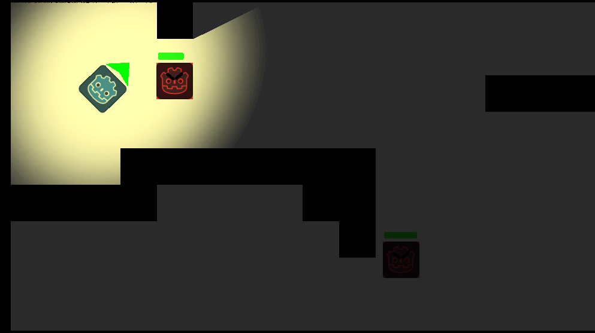

# Godot Top Down Shooter Example
_by @angrykoala_
A simple top-down shooter for learning [Godot](https://godotengine.org). Code available at https://github.com/angrykoala/top-down-godot.

# Getting started
## Creating the game from scratch (tutorial)
1. Download [Godot](https://godotengine.org/download), standard version is enough
2. [Download assets](https://github.com/angrykoala/top-down-godot/releases/download/0.1.0/top-down-shooter-assets.zip)

## Running the final game
1. Clone the repository
2. Load the project in Godot

# More Resources

* https://godotengine.org
    * [Your First Game](https://docs.godotengine.org/en/stable/getting_started/step_by_step/your_first_game.html)
* https://www.gdquest.com
    * https://www.gdquest.com/tutorial/godot/2d/your-first-game
    * [The Godot Game Engine Explained in 5 Minutes](https://www.youtube.com/watch?v=KjX5llYZ5eQ)
* https://kidscancode.org/godot_recipes/
* https://opengameart.org

# Acknowledgements

* [pistol.wav](https://opengameart.org/content/gun-sound-effects) by KonitaTutorials, CC-BY-SA 3.0
* [light_sprite.png](https://www.gdquest.com/tutorial/godot/2d/lighting-with-normal-maps/) by gdquest.com
* [game_over.mp3](https://www.youtube.com/watch?v=BH-5l6G4_Lo) by cenorexia
